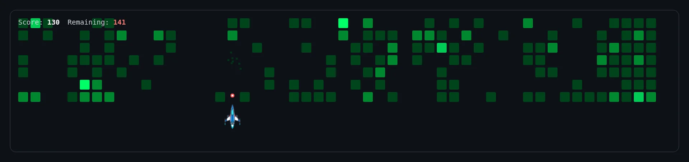

# 🚀 GitHub Contribution Rocket

An animated rocket that shoots at your GitHub contribution blocks — auto-generated as an animated WebP every day via GitHub Actions.

## How It Works

1. ⏰ **Daily at 00:00 UTC**, a GitHub Actions workflow runs automatically
2. 📊 Fetches your **latest GitHub contribution data**
3. 🎮 Renders the rocket animation using a headless browser
4. 🎬 Records 20 seconds of gameplay at 60 FPS
5. 🖼️ Converts to animated WebP (true-color, smooth) and commits it to the repo

## Add to Your GitHub Profile README

```markdown

```

Replace `YOUR_USERNAME` with your GitHub username.

**Example:**
```markdown

```

## Configuration

To use this for your own profile:

1. **Fork this repository**
2. Update the `GITHUB_USERNAME` in `.github/workflows/record-game.yml`:
   ```yaml
   env:
     GITHUB_USERNAME: your-github-username
   ```
3. Trigger the workflow manually from the **Actions** tab, or wait for the daily run

## Project Structure

```
rocket_animation/
├── .github/
│   └── workflows/
│       └── record-game.yml      # Daily WebP generation workflow
├── assets/
│   └── game-recording.webp       # Auto-generated game recording
├── components/
│   └── GameCanvas.tsx            # Rocket game canvas (React)
├── scripts/
│   └── record-game.js           # Fetch data, render, record, convert to WebP
├── services/
│   └── githubService.ts         # GitHub contributions API
├── App.tsx                       # React app (kept for reference)
├── types.ts                      # TypeScript types
├── index.html                    # HTML shell
└── package.json
```

## Tech Stack

- **Rendering**: Puppeteer + Canvas API (self-contained, no React build)
- **Recording**: Puppeteer (headless Chrome)
- **Conversion**: FFmpeg (frames → animated WebP)
- **Automation**: GitHub Actions (weekly cron)
- **Data**: [GitHub Contributions API](https://github-contributions-api.jogruber.de/)

## License

MIT
